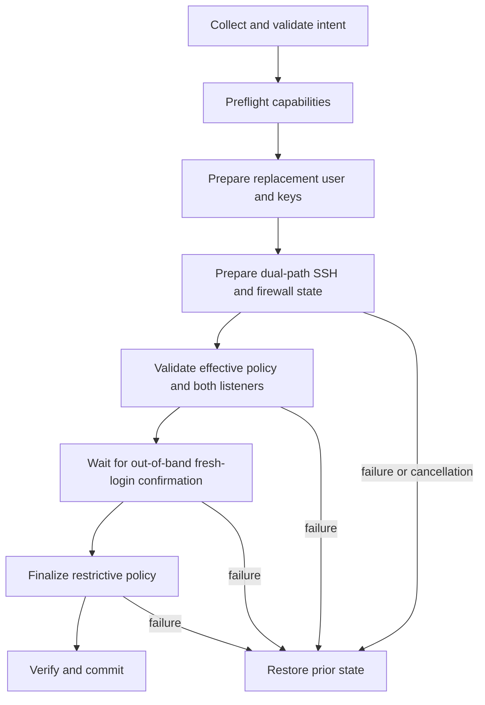

# Harden Provisioning Safety and Compatibility

## Goal Capsule

Make `sys-bootstrap` safe to run and rerun on fresh Debian 11+ and Ubuntu 22+ VPS hosts without silently reporting incomplete setup, hanging indefinitely, or leaving SSH in a future-lockout state.

Authority order for implementation decisions:

1. Prevent remote lockout, privilege-boundary violations, and unauthenticated root downloads.
2. Preserve explicit user choices and fail with actionable diagnostics when they cannot be fulfilled.
3. Keep reruns convergent after interruption or partial failure.
4. Preserve current CLI/TUI behavior unless this plan explicitly changes its contract.

Stop and request review if implementation would disable an existing login method before a replacement path is verified, introduce a new privileged network trust mechanism, or broaden supported distributions beyond apt-based Debian/Ubuntu systems.

Execution profile: three delivery batches. Batch A is release-blocking. Batches B and C may land separately after Batch A, but each implementation unit must pass its own verification before the next dependent unit starts.

---

## Product Contract

### Summary

The provisioner remains an interactive Go CLI plus shell installer. This work hardens existing operations rather than adding new setup features.

### Problem Frame

The current happy paths pass unit tests, but several host-state transitions are unsafe: SSH policy may activate before a replacement login exists; requested key setup may fail silently; OpenSSH includes can make reported settings differ from effective settings; privileged writes follow user-controlled links; optional download metadata failures can terminate the installer; and network or apt operations have inconsistent timeout and noninteractive behavior.

### Requirements

- R1. SSH hardening uses a two-phase cutover: prepare the replacement path while retaining the old port and authentication methods, then finalize restrictions only after the operator explicitly confirms a successful fresh login over the replacement path from another terminal.
- R2. Every failure before finalization reverses only changes owned by the current run. If rollback or restoration verification fails, the tool must preserve the existing daemon process where possible, stop further mutation, and emit an emergency recovery report without claiming the old path is usable.
- R3. The requested SSH port and authentication policy must be verified from effective `sshd` configuration, not inferred from edited text alone.
- R4. Privileged user-home writes must reject link traversal and use the target account's passwd-resolved home and ownership.
- R5. When the user explicitly requests an SSH key, fetch, validation, write, ownership, or permission failure must fail the module rather than report success.
- R6. Root-installed remote artifacts must use immutable versions and version-bound expected digests from the declared release trust path; verification must fail closed for privileged installation.
- R7. China-region installer metadata and asset retrieval must use a bounded fallback chain in which an optional endpoint failure cannot trigger an accidental `set -e` exit.
- R8. Network, subprocess, and apt operations must have bounded cancellation behavior and retain useful error classification.
- R9. Runtime preflight must match module prerequisites: a capability may not be a warning if a selected module requires it unconditionally.
- R10. User inputs that can cause late destructive or privileged failure must be rejected before the execution plan is confirmed.
- R11. Rerunning after success or partial failure must converge without duplicate keys, accumulating managed SSH directives, or skipping a newly requested mirror change.
- R12. Existing user-visible commands and the user/full run-mode distinction remain compatible, and every entry mode follows the normative privilege/target-home matrix in this plan.

### Acceptance Examples

- AE1. Given a VPS where only root/password SSH works, when the user asks to disable both, then preparation keeps the old path active and finalization remains pending until the operator confirms a successful fresh login from another terminal; declining, EOF, timeout, or noninteractive execution leaves the dual-path state in place.
- AE2. Given a UFW, reload, listener, or confirmation failure before finalization, when SSH hardening aborts, then tool-owned deltas are reversed and the old effective listener is verified. If restoration cannot be verified, the command exits nonzero with both errors and an emergency recovery report rather than asserting successful rollback.
- AE3. Given a trailing `Match` block or a conflicting `sshd_config.d` entry, when the requested settings cannot become effective, then the module fails before activation and identifies the conflicting effective value.
- AE4. Given an existing user whose home is not `/home/<name>`, when a key is installed, then it is written only under the passwd-resolved home with correct ownership and modes.
- AE5. Given a symlinked `.ssh` directory or `authorized_keys`, when running through sudo, then the module rejects the path without writing through the link.
- AE6. Given GitHub key retrieval returns timeout, non-200, empty, oversized, or malformed content, then user creation does not report successful key provisioning.
- AE7. Given jsDelivr is unavailable but GitHub metadata and assets work, then the installer continues through the declared fallback rather than exiting from `pipefail`; if authoritative GitHub release metadata or checksum retrieval is unavailable, privileged installation fails clearly instead of weakening verification.
- AE8. Given a slow or locked apt environment, then the operation waits or retries only within documented bounds and exits with lock/network/package-state diagnostics.
- AE9. Given malformed SSH port, username, GitHub handle, or public key input, then the form rejects it before displaying the final execution plan.
- AE10. Given a completed run, when the same selection is rerun, then no duplicate authorized key or managed SSH directive is added and an explicit mirror change is not skipped.

### Scope Boundaries

In scope:

- SSH transaction ordering, effective configuration validation, service activation, firewall rollback, and access-path guards.
- User/key filesystem safety and requested-key failure semantics.
- Installer artifact pinning, checksums, endpoint fallback, and bounded download behavior.
- Shared command cancellation/deadline behavior, apt execution policy, capability preflight, input validation, and convergence checks.
- Tests and documentation necessary to prove those behaviors.

Out of scope:

- Supporting non-apt distributions.
- Replacing nvm, pnpm, bun, Claude Code, Codex, UFW, or OpenSSH with different products.
- Building a general transaction framework for every module.
- Fully unattended provisioning or adding a new declarative configuration format.
- Refactoring the entire CLI, module interface, or UI library.
- Release signing infrastructure beyond immutable version plus verified digest; provenance/attestation may be follow-up work.

---

## Planning Contract

### Key Technical Decisions

- KTD1. Treat SSH hardening as two commits. Prepare adds the replacement key/port while retaining old access; the CLI then pauses and instructs the operator to test a fresh login from another terminal. Finalize applies restrictive authentication only after explicit interactive confirmation. The tool records this as operator attestation, not cryptographic proof of client-key possession. Decline, EOF, timeout, noninteractive execution, cancellation, or process exit leaves the dual-path prepared state and old access enabled.
- KTD2. Establish replacement access before restriction. User creation/key installation runs before SSH preparation when both are selected, but SSH recomputes candidate access paths from OS and filesystem state immediately before staging. It does not trust an in-memory success flag from another module.
- KTD3. Manage SSH settings in `/etc/ssh/sshd_config.d/00-sys-bootstrap.conf`, but only when the main config has an effective early Include compatible with that strategy; otherwise fail before mutation. Scalar authentication directives are owned by this early drop-in. Port handling is explicitly additive: prepare retains old effective ports plus the new port; finalize requires unmanaged extra Port directives to be removed by the operator or fails without editing unrelated files. Validate global settings and representative root/target-user contexts with `sshd -T`/`-C`.
- KTD4. All writes beneath a non-root target home execute with that target UID/GID, a passwd-resolved `HOME`, and a minimal environment, so user-controlled links cannot redirect a root write. Reject symlinked `.ssh` or `authorized_keys` for correctness, but do not build a root-owned generic path traversal subsystem. Direct-root mode targets `/root` and applies the same no-link and atomic-write checks.
- KTD5. Use one shared execution policy for external operations: signal-aware parent context, operation-specific deadlines, bounded retries only for idempotent transient failures, and preservation of cancellation errors.
- KTD6. Apt operations use an explicit Debian noninteractive policy, bounded lock acquisition, bounded acquire retries, and post-failure package-state diagnostics. The policy must not silently overwrite locally modified conffiles.
- KTD7. Third-party privileged artifacts such as Zellij use a repository-reviewed literal manifest in Go source containing version, asset name, architecture, and SHA-256; runtime never resolves `latest` or replaces those digests from the network. The first-party `sys-bootstrap` installer may resolve an official GitHub release and verify its co-published version-bound checksum over the authoritative GitHub path; regional proxies/CDNs may transfer assets but cannot redefine version or digest. Stronger signed provenance remains follow-up work. No downloaded bootstrap binary executes without successful verification in any mode.
- KTD8. Input validation occurs in the form layer and is repeated at module boundaries. UI validation improves feedback; module validation remains the security and correctness boundary.
- KTD9. Idempotency is evaluated against requested configuration, not only tool presence. Checks may be split into substep convergence where a whole-module satisfied boolean would skip requested work.
- KTD10. Represent replacement candidates as a recomputed `AccessPath` contract: target username/UID, passwd home, canonical key fingerprint, source selection, authorized-key ownership/mode facts, effective public-key authentication, and prepared port. Candidate sources are the new-user key when configured and the invoking-target key when configured; one or more may coexist, and the confirmation prompt names exactly which account, port, and fingerprint the operator must test.
- KTD11. Rollback uses a transaction journal captured before mutation: prior managed-drop-in bytes/metadata or absence, service active/enabled state, old effective ports/policy, and only the exact firewall rule delta added by this run. Cleanup runs under a fresh bounded context that is not canceled with the main operation, reverses only journaled deltas, reloads the restored candidate, and verifies the old listener before returning.

### High-Level Technical Design

The executor should keep the transaction local to SSH-related code. A repository-wide transaction abstraction is not required.

### Sequencing

1. Batch A: U1, then U3, then U2. These units define the access contract, harden key preparation, and finally activate the two-phase SSH transaction.
2. Batch B: U5, then U4. These units establish bounded execution before applying it to downloads and installer fallback.
3. Batch C: U6. This unit tightens validation and convergence after the safety primitives are stable.
4. U7 updates operational documentation and runs the complete verification matrix after all code units.

### Assumptions

- Target SSH implementations are the OpenSSH packages shipped by Debian 11/12 and Ubuntu 22.04/24.04.
- systemd remains the primary supported service manager for SSH mutation. A host without a supported service controller must fail preflight before modifying configuration; implementing another init system is out of scope.
- A live end-to-end reconnect assertion requires disposable VM fixtures or a controlled integration environment; unit tests alone are insufficient for Batch A acceptance.
- Existing public CLI command names and environment variables remain stable.

### Privilege and target-home matrix

| Entry path | Effective UID | Target account and HOME | Privileged operations | Artifact verification and escalation |
|---|---:|---|---|---|
| Temporary user mode as non-root | invoking UID | passwd entry for invoking user | none | verification required; cannot escalate inside this mode |
| Temporary full mode through sudo | root | system work as root; user-level work uses `SUDO_USER` passwd entry | only selected full-mode modules | verification occurs before sudo execution; target-user subprocesses use minimal explicit environment |
| Installed binary run as non-root | invoking UID | passwd entry for invoking user | none; full mode fails before forms/mutation | installed binary was previously verified; no implicit sudo re-exec |
| Installed binary run through sudo | root | same split as temporary full mode | only selected full-mode modules | inherited `HOME`, `NVM_DIR`, `PNPM_HOME`, and similar variables are not trusted for target resolution |
| Direct root invocation | root | `/root` unless a future explicit target option is added | selected full-mode modules | user-level modules require the existing explicit root confirmation; no inferred non-root target |

---

## Implementation Units

### U1. Enforce safe module order and access-path preconditions

**Goal:** Ensure replacement access exists before SSH restrictions can be activated.

**Requirements:** R1, R2, R5, R12; AE1, AE2.

**Files:**

- `internal/app/app.go`
- `internal/modules/registry.go`
- `internal/modules/ssh.go`
- `internal/cli/commands.go`
- `internal/types/types.go`
- `internal/ui/forms.go`
- `internal/app/runner_test.go`
- `internal/modules/registry_test.go`
- `internal/modules/ssh_test.go`

**Approach:** Order user preparation before SSH hardening when both are selected. Define the recomputed `AccessPath` candidate contract and an interactive confirmation checkpoint that names the account, replacement port, and key fingerprint to test from another terminal. Do not claim transport-level proof: finalization relies on explicit operator attestation. Reject unsafe combinations before persistent SSH mutation, prohibit noninteractive finalization, and leave old access enabled when confirmation does not arrive.

**Test Scenarios:**

1. Selecting user plus SSH resolves user before SSH without changing unrelated module dependency order.
2. Disabling password and root login without a verified alternative returns an error before config write, firewall change, or service reload.
3. Supplying a malformed or empty requested key does not satisfy the access-path guard.
4. The confirmation screen identifies the exact account, port, fingerprint, and test command without exposing private material.
5. Decline, EOF, timeout, noninteractive execution, Ctrl-C, or process death leaves the old port/authentication effective and reports hardening pending.
6. Only an explicit affirmative response in the active interactive run enters finalization; empty input is not affirmative.
7. Existing safe configurations remain eligible for port-only changes without falsely claiming client-key possession.
8. Running only SSH still applies the same two-phase safety contract.

**Verification:** Unit tests prove ordering and preconditions through observable calls/state rather than private implementation details.

**Dependencies:** None.

### U2. Make SSH mutation transactional and verify effective configuration

**Goal:** Prevent partial SSH/firewall state and prove requested settings are actually active.

**Requirements:** R1, R2, R3, R11; AE2, AE3, AE10.

**Files:**

- `internal/modules/ssh.go`
- `internal/modules/ssh_test.go`
- `internal/system/command.go`
- new fixtures under `internal/modules/testdata/sshd_config/`

**Approach:** Implement the two-phase state machine inside the SSH flow using the managed early drop-in and transaction journal defined by KTD3/KTD11. Prepare a dual-path candidate, validate global and representative connection contexts, add only a missing tool-owned firewall rule, reload, and verify old plus new listeners. After explicit out-of-band login confirmation, finalize restrictive policy and verify again. Rollback runs under its cleanup context and reports combined errors when restoration cannot be verified.

**Test Scenarios:**

1. Stock Debian/Ubuntu main configuration produces requested effective port and authentication values.
2. Conflicting include/drop-in values are either deterministically superseded or rejected before activation.
3. Missing/late Include, a trailing `Match`, conflicting conditional auth, or unmanaged extra final Port values fail before destructive finalization.
4. Candidate syntax failure preserves prior managed-file bytes/absence, metadata, service state, and firewall state.
5. Pre-existing equivalent UFW rules are recorded but not owned or deleted; rules added by this run are the only rollback delta.
6. UFW failure, reload failure, listener verification failure, confirmation failure, and cancellation each invoke rollback exactly once.
7. Cancellation during normal work does not cancel bounded cleanup; cleanup timeout returns the original and restoration errors.
8. Rollback verification failure emits recovery state without claiming the old listener works.
9. Successful rerun does not add duplicate managed directives or unnecessary firewall rules.

**Verification:** Unit failure injection plus disposable-VM tests demonstrate that the old connection path remains usable after every injected failure and that a fresh connection works after success.

**Dependencies:** U1 and U3.

### U3. Harden user and authorized-key provisioning

**Goal:** Make requested key setup truthful, home-aware, atomic, and resistant to link traversal.

**Requirements:** R4, R5, R11; AE4, AE5, AE6, AE10.

**Files:**

- `internal/modules/user.go`
- `internal/modules/ssh.go`
- `internal/modules/ssh_keygen.go`
- `internal/system/command.go`
- `internal/modules/user_test.go`
- `internal/modules/ssh_test.go`

**Approach:** Resolve target accounts through the OS user database rather than constructing `/home/<name>`. Validate every key line using an OpenSSH-aware parser or a safely invoked system validator. Bound HTTP response size and time. When key setup is requested, propagate all fetch, empty, validation, directory, write, close, chmod, and ownership failures. Perform non-root home writes under the target UID/GID with a minimal environment, reject linked key paths, and atomically replace the file within the target-owned `.ssh` directory. Deduplicate keys without discarding existing authorized-key options or comments.

**Test Scenarios:**

1. Existing user with a custom home receives the key only in that home.
2. Symlinked `.ssh`, symlinked `authorized_keys`, wrong owner, and unsafe parent components are rejected without modifying the link target.
3. GitHub timeout, non-success response, oversized body, empty response, malformed first key, and malformed later key all fail requested provisioning.
4. Multi-key GitHub responses validate every nonblank line and preserve valid line boundaries.
5. Repeating the same key operation produces one authorized-key entry.
6. Atomic write failure leaves the previous file unchanged and reports failure.
7. File and directory permissions and ownership match OpenSSH expectations for both direct-root and sudo-invoking-user flows.

**Verification:** Filesystem tests use temporary homes with adversarial links and ownership fixtures; HTTP tests use a local test server with deterministic failure modes.

**Dependencies:** U1. U2 recomputes the `AccessPath` facts from the state produced here rather than consuming an in-memory module result.

### U4. Pin and verify privileged downloads and repair installer fallback

**Goal:** Remove mutable/unverified root downloads while preserving regional availability.

**Requirements:** R6, R7; AE7.

**Files:**

- `internal/modules/base.go`
- `internal/modules/checksum.go`
- `internal/modules/checksum_test.go`
- `scripts/install.sh`
- `scripts/install_test.sh`
- `README.md`

**Approach:** Pin Zellij in a repository-reviewed literal manifest with per-architecture asset names and digests, and verify before extraction/install. Make installer metadata and asset resolution an explicit fallback chain whose optional failures are handled inside conditional branches safe under `set -euo pipefail`. Use bounded download behavior. Require verified digest before executing the downloaded bootstrap binary in every mode; remove the interactive verification bypass.

**Test Scenarios:**

1. Correct Zellij archive installs only after digest match; mismatch and unknown architecture fail before extraction.
2. Archive missing the expected binary or containing an unsafe entry cannot replace `/usr/local/bin/zellij`.
3. jsDelivr failure falls back without terminating from command substitution status.
4. GitHub API or checksum failure exits with a clear authoritative-metadata error, not an unbound pipeline failure or a silent downgrade.
5. Asset-source failure proceeds through the declared order and never verifies an asset against metadata from a different version.
6. Missing, empty, malformed, or mismatched checksum fails closed for installation and full/root execution.
7. Every curl branch has bounded connect, transfer, and retry behavior.

**Verification:** Shell tests stub each endpoint independently under `set -euo pipefail`; Go tests cover pinned asset selection and digest rejection.

**Dependencies:** U5 for the shared Go command/download policy. Shell fallback work may be prepared in parallel, but U4 is accepted only after U5's bounded execution contract is settled.

### U5. Add bounded execution, apt policy, and capability-accurate preflight

**Goal:** Make dependency outages and unsupported host capabilities fail predictably instead of hanging or failing after mutation.

**Requirements:** R8, R9, R12; AE8.

**Files:**

- `cmd/sys-bootstrap/main.go`
- `cmd/sys-bootstrap/main_test.go`
- `.gitignore`
- `internal/system/command.go`
- `internal/system/command_test.go`
- `internal/system/context.go`
- `internal/system/context_test.go`
- `internal/modules/base.go`
- `internal/modules/ssh.go`
- `internal/modules/node.go`
- `internal/cli/commands.go`
- `internal/cli/commands_test.go`

**Approach:** Establish a signal-aware root context and preserve cancellation/deadline errors from subprocess helpers. Define operation-specific deadline and retry policy without retrying state-changing user/config operations. Centralize apt invocation with explicit lock wait, acquire retry, noninteractive, conffile, and diagnostics policy. Replace the single-host fatal network oracle with capability and endpoint checks relevant to selected work. Fail SSH preflight before mutation on unsupported service management; fail or provide an actionable installation path when user mode selects modules that require missing curl/bash.

The `.gitignore` rule for the root `sys-bootstrap` binary must be anchored so `cmd/sys-bootstrap/main_test.go` is tracked and can prove signal wiring.

**Test Scenarios:**

1. Cancel-before-start and cancel-during-command return recognizable cancellation errors.
2. A shell command with descendants is terminated and reaped within the cancellation bound.
3. Retry occurs only for classified transient idempotent failures and stops at the configured attempt/deadline bound.
4. Apt lock contention waits within bounds, then either succeeds or reports lock ownership/state without starting later steps.
5. Apt closed-stdin scenarios do not prompt; modified conffiles follow the documented preservation policy.
6. A blocked `deb.debian.org` lookup alone does not prevent a run whose selected endpoints are reachable.
7. Missing curl in user mode and missing systemd/service controller for SSH fail preflight before module mutation.
8. Direct `run`, default menu, `doctor`, and installer-launched modes apply compatible capability rules.

**Verification:** Deterministic fake-command tests cover timing and error classification; disposable Debian/Ubuntu images cover apt locks, pending upgrades, and service management.

**Dependencies:** None; independent of U1-U3.

### U6. Validate privileged inputs and make checks configuration-aware

**Goal:** Reject bad intent early and make reruns converge on requested state.

**Requirements:** R10, R11, R12; AE9, AE10.

**Files:**

- `internal/ui/forms.go`
- `internal/types/types.go`
- `internal/modules/ssh.go`
- `internal/modules/user.go`
- `internal/modules/base.go`
- `internal/modules/ai.go`
- `internal/app/runner.go`
- `internal/app/runner_test.go`
- `internal/modules/ssh_test.go`
- `internal/modules/user_test.go`
- `internal/modules/node_test.go`
- `internal/system/aptmirror_test.go`

**Approach:** Add shared validation for SSH port range, username, GitHub handle, key material, and mutually unsafe auth choices, called from both forms and modules. Refine satisfied checks so they account for requested state: mirror choice cannot be skipped because packages exist; selected AI-tool state cannot require unrelated tools; repeated key and SSH operations remain convergent. Avoid expanding the module interface unless configuration-aware checks cannot be expressed safely through targeted runner policy.

**Test Scenarios:**

1. Ports below 1, above 65535, malformed, partially numeric, and whitespace-only are rejected before plan confirmation and again at module entry.
2. Empty/invalid usernames and GitHub handles are rejected before any earlier module executes.
3. Structurally invalid public keys with valid-looking prefixes are rejected.
4. All base packages present plus a newly requested CERNET mirror still runs the mirror convergence step.
5. A completed base run follows the documented update freshness policy rather than silently skipping recurring work.
6. Installing only one AI tool can reach a satisfied state without reinstalling it on every run.
7. Repeated successful runs produce no duplicate keys, managed SSH directives, or shell startup blocks.
8. Existing valid CLI and environment-driven configurations continue to work.

**Verification:** Table-driven boundary tests plus rerun/convergence tests compare filesystem and plan state after first and second execution.

**Dependencies:** U1-U5, because it codifies the final requested-state and validation contracts.

### U7. Document recovery and execute the compatibility matrix

**Goal:** Make the hardened behavior reviewable and operable on real disposable hosts.

**Requirements:** R1-R12; AE1-AE10.

**Files:**

- `README.md`
- `CLAUDE.md`
- `scripts/install_test.sh`
- `.github/workflows/checks.yml`

**Approach:** Update safety claims to match implemented transaction, verification, timeout, and idempotency behavior. Document failure recovery and the supported systemd boundary. Run the release-like Linux build and disposable-host matrix; do not claim a distribution is verified based only on unit tests or mocked shell tests.

**Test Scenarios:**

1. Debian 11 and 12, Ubuntu 22.04 and 24.04 on amd64 complete user-mode installation, full-mode non-SSH installation, and safe rerun.
2. Available arm64 fixtures complete build and non-destructive smoke checks.
3. SSH scenarios verify the out-of-band confirmation checkpoint and successful finalization; ordinary injected failures verify restored old access, while injected rollback failures verify the emergency recovery contract without claiming connectivity.
4. Network blackhole, DNS failure, checksum failure, apt lock, pending dpkg state, missing curl, and missing service manager produce bounded actionable failures.
5. Installer temporary-user, temporary-full, and installed-binary paths preserve intended environment and privilege targeting.

**Verification:** Matrix evidence is attached to the implementation handoff or PR; any skipped platform is explicitly recorded as unverified rather than assumed compatible.

**Dependencies:** U1-U6.

---

## Verification Contract

### Required automated gates

- `go test ./...` passes.
- `go test -race ./...` passes.
- `go vet ./...` passes.
- ShellCheck reports no findings for `scripts/install.sh` and `scripts/install_test.sh`.
- `bash -n` succeeds for both shell scripts.
- `bash scripts/install_test.sh` passes with new fallback, checksum, and privilege-mode cases.
- Static Linux amd64 and arm64 release builds succeed using the Go version declared by CI.

### Required behavioral gates

- SSH transaction tests inject failure at config write, validation, firewall update, reload, listener verification, key preparation, and cancellation boundaries.
- At least one disposable Debian or Ubuntu VM proves the fresh-login confirmation flow and success after commit, verifies old-port recovery when rollback succeeds, and verifies emergency reporting when rollback itself fails.
- Filesystem tests prove no privileged write follows `.ssh` or `authorized_keys` links.
- Download tests prove privileged installation cannot continue with absent or mismatched integrity metadata.
- Timeout tests use deterministic local fakes; they must not rely on public network timing.
- Rerun tests compare first-run and second-run state for managed config, keys, shell blocks, mirror state, and selected AI tools.

### Review gates

- Batch A receives a focused security and reliability review before any real VPS trial.
- Any change to the trust source for release checksums or to SSH activation semantics requires explicit human review.
- The implementation must not weaken failures into warnings merely to keep the full run progressing.

---

## Definition of Done

- Every requirement R1-R12 is covered by implemented behavior and at least one named test or VM scenario.
- U1-U7 meet their verification clauses in dependency order.
- No code path activates restrictive SSH policy before explicit interactive operator confirmation of a successful fresh replacement login.
- Every pre-commit SSH failure has a tested rollback outcome; rollback failure is never hidden.
- Effective sshd values, listener state, firewall state, key ownership, and permissions are verified rather than inferred.
- Root-installed artifacts are immutable and digest-verified.
- External operations are bounded and cancellation remains distinguishable from ordinary command failure.
- Invalid privileged inputs fail before execution begins.
- A second identical run is convergent, and an explicit configuration change is not skipped by a stale satisfied check.
- README and project guidance describe actual guarantees and supported boundaries without overstating test coverage.
- Abandoned implementations, unused helpers, temporary compatibility branches, and dead test fixtures are removed before handoff.
- The repository is left with no unrelated edits and all required automated gates passing.
